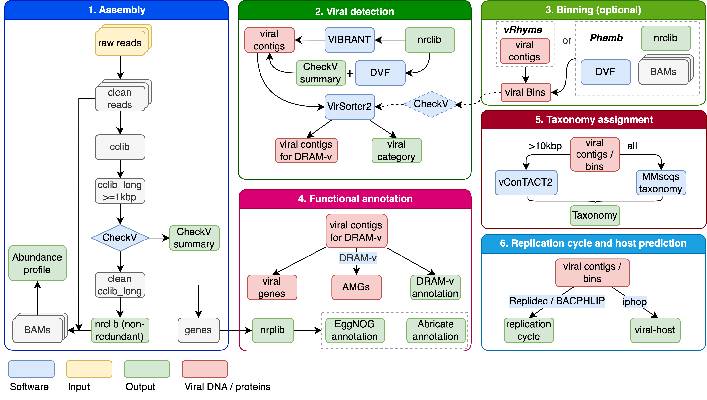

# ViroProfiler: a containerized bioinformatics pipeline for viral metagenomic data analysis

[](https://www.nextflow.io/)
[](https://www.docker.com/)
[](https://sylabs.io/docs/)
[](https://zenodo.org/badge/latestdoi/537899739)

```
                                        __
oooooo     oooo oo                    88  88                    .o8o.  oo  ooo
 `888.     .8'  `'                   88 ss 88                   88 `"  `'  `88
  `888.   .8'  ooo  ooood8b  o888o    88__88   ooooo8b  o888o  o88o   ooo   88   .oooo.  ooooo8b
   `888. .8'   `88   88""8P d8' `8b     ||      88""8P d8' `8b  88    `88   88  d8'  `8b  88""8P
    `888.8'     88   88     88   88    _||_     88     88   88  88     88   88  888ooo88  88
     `888'      88   88     88   88  // || \\   88     88   88  88     88   88  88    .o  88
      `8'      o88o o88b     o888o  //      \\ d88b     o888o  o88o   o88o o88o `Y8bd8P' 088b

```

## Introduction

ViroProfiler is a bioinformatics best-practice analysis pipeline for viral metagenomics data analyses.

The pipeline is built using [Nextflow](https://www.nextflow.io), a workflow tool to run tasks across multiple compute infrastructures in a very portable manner. It uses Docker/Singularity containers making installation trivial and results highly reproducible.



## Quick Start

1. Install [Miniconda3](https://docs.conda.io/en/latest/miniconda.html).

2. Install Nextflow and Singularity using conda:

   ```bash
   # You may need to restart your terminal before running the following commands
   conda install -c conda-forge -c bioconda nextflow singularity
   ```

3. Download the pipeline and database.

   ```bash
   # setup database
   nextflow run deng-lab/viroprofiler -r main -profile singularity --mode "setup"
   ```

4. Run the pipeline,

   ```bash
   # run test
   nextflow run deng-lab/viroprofiler -r main -profile singularity,test

   # run your own data
   nextflow run deng-lab/viroprofiler -r main -profile singularity --input samplesheet.csv
   ```

   Please refer to the [tutorial](https://deng-lab.github.io/viroprofiler/tutorial) for more information on how to run the pipeline with customized parameters and options.

## Documentation

Please refer to the [documentation](https://deng-lab.github.io/viroprofiler).

## Contributions and Support

If you would like to contribute to this pipeline, please see the [contributing guidelines](.github/CONTRIBUTING.md).

For further information or help, please [open an issue](https://github.com/deng-lab/viroprofiler/issues).

## Citations

If you use  ViroProfiler for your analysis, please cite the publication as follows:

> *Jinlong Ru, Mohammadali Khan Mirzaei, Jinling Xue, Xue Peng, Li Deng*. **ViroProfiler: a containerized bioinformatics pipeline for viral metagenomic data analysis**. *Gut Microbes* (2023); doi: https://doi.org/10.1080/19490976.2023.2192522

An extensive list of references for the tools and data used by the pipeline can be found in the [`CITATIONS.md`](CITATIONS.md) file. If you use ViroProfiler for your work, please cite the relevant references.
